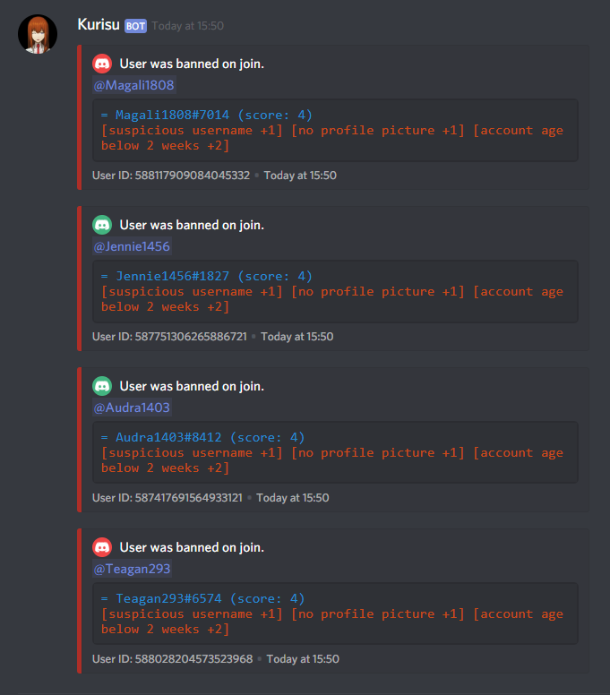

# Discord Bouncer Bot
Bot that automatically bans suspicious accounts (mostly spambots). Lets false positives verify themselves using Google's ReCaptcha.



# Usage
Install dependencies using `npm install`, customise `config.js`, and run
the bot using `npm start`.

# Commands

```markdown
Help
----
Commands used to show this message:

# !ss
# !ss help


Suspect list
------------
The bot maintains a list of suspects for each server. This list can be
used to kick or ban suspicious members. By default, the list is empty. 

# !ss prepare [threshold=3]
→ Initialises the list of suspects based on the list of current server
  members. Suspects with score less than the threshold are ignored.
  
# !ss spare <indices>
→ Removes users with specified indices from the suspect list. The
  indices have to be separated with commas.
  
# !ss kick
→ Kicks all of the users on the suspect list.

# !ss ban
→ Bans all of the users on the suspect list, sending each one a message
  with a verification link.
  
# !ss list
→ Shows the current list of suspects, indicating the score of each suspect.


Util
----

# !ss report-here
→ Makes the bot report all of its automatic actions (mostly bans and
  unbans) to the current channel.

# !ss no-report
→ Disables automatic reporting.
```